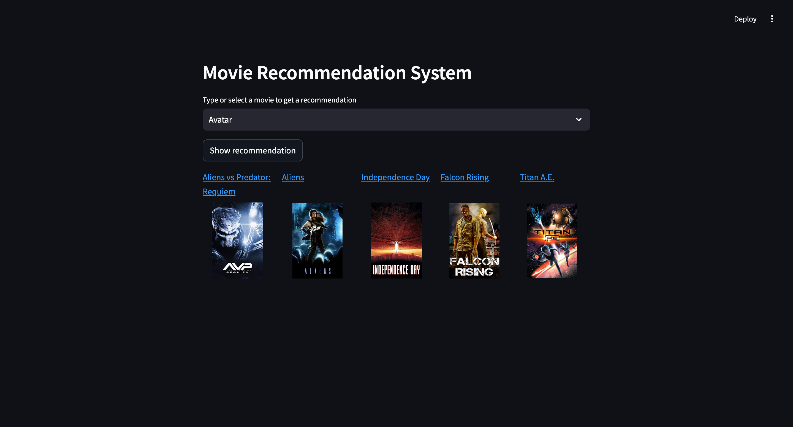

# Naive movie recommendation system

This is only the first version of Movie RecSys with many simplifications.\
Further I'll add another more advanced methods such as BERT embeddings for text features and feature selection methods.\

### Sources:
- The code is based on [YouTube playlist](https://www.youtube.com/playlist?list=PLkz_y24mlSJYWa_JEjptWvwXToNNXIXOp) with some midifications.
- The data is taken from [Kaggle TMDB 5000 Movie Dataset](https://www.kaggle.com/datasets/tmdb/tmdb-movie-metadata).
- [TMDB website](https://www.themoviedb.org/)
- [TMDB API webpage](https://developer.themoviedb.org/reference/intro/getting-started)

### Virtual Environment:
```
source movie_rec_venv/bin/activate
```

### Install:
```
pip install -r requirements.txt
```

### Quick Start (Mac)

Firstly you need to execute main.py file to get necessary artifacts:
```
python main.py
```

Then launch streamlit web-app run the code below:
```
streamlit run app.py
```

If you did everything correctly, you can use my recommendation system without any problems. Congratulations!\
